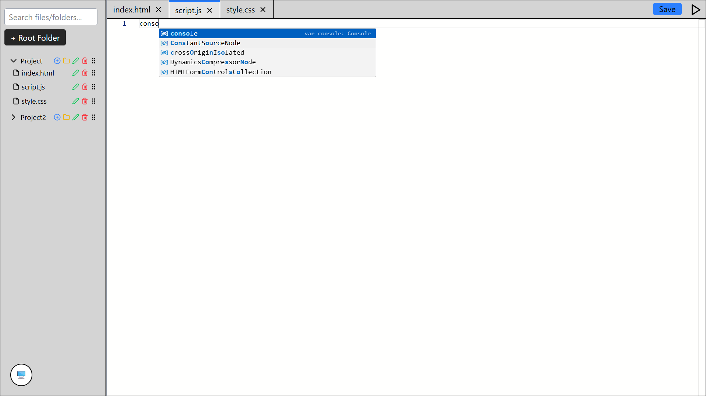
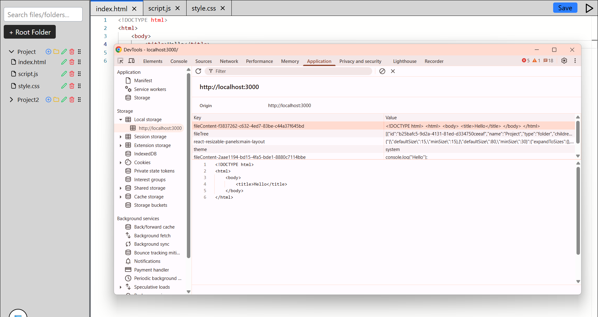
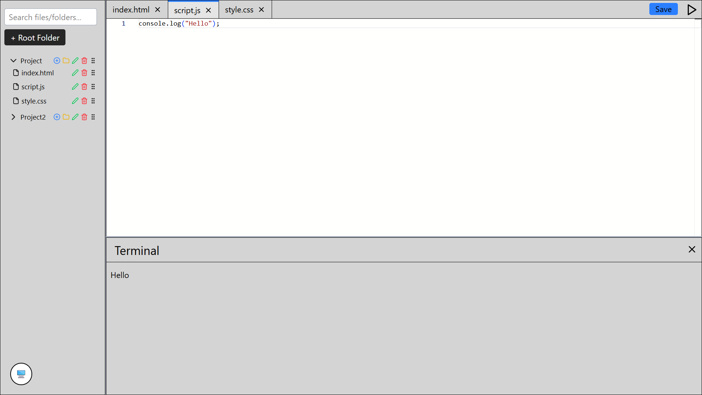
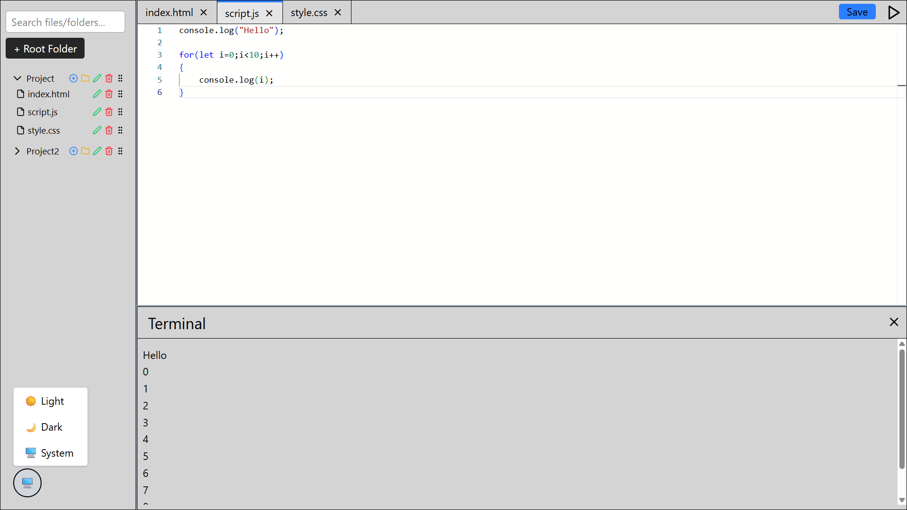

# 🖥️ VS Code – style web code editor

This is a web-based code editor inspired by Visual Studio Code, built using Next.js, Tailwind CSS, and Monaco Editor. It replicates core IDE-like features - such as file navigation, multi-tab editing, syntax highlighting, and JavaScript execution - entirely within the browser. This project is ideal for learning, rapid prototyping, or showcasing coding environments without any backend dependencies.

## 🧱 Tech Stack
- Next.js – React Framework
- Tailwind CSS – Utility-first styling
- @monaco-editor/react – Code editor
- Local state – State management
- localStorage – Data persistence

---

## ✅ Features
1. Project Explorer : Create, rename, delete, and organize files/folders with drag-and-drop and nested support. Changes persist via localStorage.
2. Tabbed Editor : Open multiple files in tabs, reorder or close them, and track unsaved changes.
3. Monaco Editor : Integrated with syntax highlighting for JavaScript, HTML, and CSS. Auto-saves content to localStorage.
4. JavaScript Execution : Run '.js' files safely in a sandboxed iframe and view output in a terminal-like panel.
5. Resizable Layout : Adjustable sidebar-editor and editor-terminal panes for a flexible workspace.
6. Theme Toggle : Switch between Light and Dark themes, with system preference detection.
7. Search : Quickly filter and highlight files/folders by name.

---

## ⚙️ Setup Instructions

### 1. Clone the Repository

```bash
git clone https://github.com/dhruv-33/web-code-editor.git
cd web-code-editor
```
### 2. Install Dependencies

```bash
npm install
# or
yarn install
```

### 3. Start the Development Server

```bash
npm run dev
# or
yarn dev
```

- Then visit: http://localhost:3000 in your browser.

---

## 🖼️ Screenshots

### 1. Main UI
- Main UI :


### 2. File & Folder Operations
- Add Folder : 
- Add File : 
- Rename : 
- Same Name Error : 
- After Rename : 
- Drag : 
- After Drag : 
- Delete : 
- Save FileTree in LocalStorage : 

### 3. Editor Features
- Monaco Editor :  
- Tabs Open : 
- Auto Save : 
- Highlight HTML : 
- Highlight CSS : 
- Highlight JavaScript : 
- Save Content in Localstorage : 

### 4. Terminal & Run
- Terminal : 
- Run HTML : 
- Run JS : 

### 5. Resizing Pannel
- Resizable Panel : 

### 6. Theme
- Theme : 
- Theme System : 
- Theme Dark : 
- Theme Light : 

### 7. Search
- Search :  

## 🙌 Contributions
- Feel free to fork the repo, raise issues, and submit pull requests.

## 📜 License
- This project is open-source and available under the MIT License.

🚀 Happy Coding! 🎉